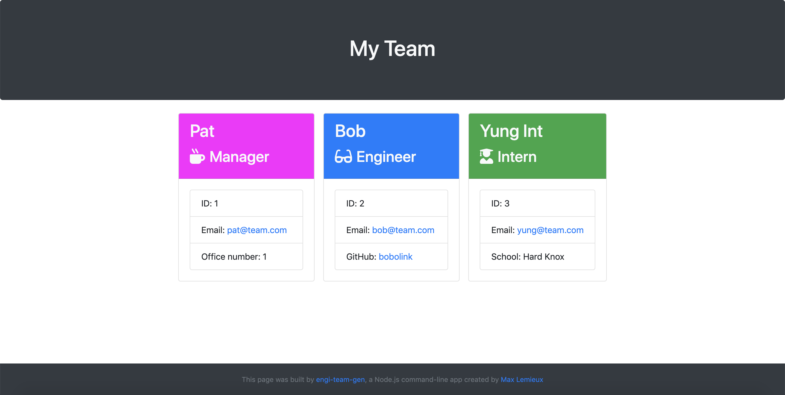
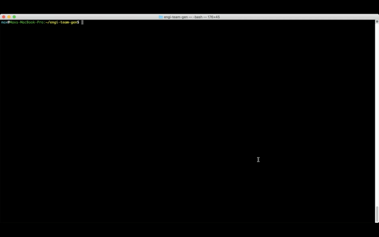

# engi-team-gen

## Table of Contents
* [About](#about)
* [Installation](#installation)
* [Usage](#usage)
* [Demo](#demo)
* [Tests](#tests)
* [License](#license)
        
## About
engi-team-gen is a CLI app built in Node.js. Creates HTML output visualizing the structure of workplace teams.

A team consists of a manager (required), optionally also including any number of engineers and interns.

Here's an example of what you get when you add a manager, an engineer and an intern to your team:

## Installation
Clone the repo:

`git clone https://github.com/maxlemieux/engi-team-gen`

Then install the dependencies (figlet, chalk and inquirer):

`npm i`

## Usage
Run the app and answer the prompts.

`node app.js`

Afterwards, the `/output` directory will contain the file `team.html`, showing the information provided.

## Demo
Here's a quick demo of functionality:

## Tests
engi-team-gen comes with a test suite for Jest. Currently, all tests should pass. Run tests with the script:

`npm run test`

## License
This code is licensed under the [MIT License](https://opensource.org/licenses/MIT).

## Technologies used
* Node.js
* Inquirer.js
* Bootstrap 4
